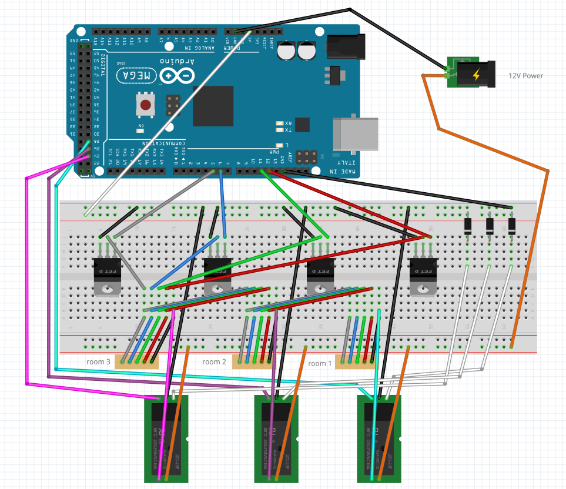

## Introduction and History

I started this project with a goal of easing seasonal depression symptoms and making it easier to get up in the morning, all the way back in 2017 in my first apartment that wasn't a University dorm. I made a naive purchase of some SuperNight 12V waterproof LEDs, which got me started controlling these LEDs with an IR remote. This is obviously limited in multiple ways:

- no saved custom colors
- no custom gradients
- overall limited customizability

Soon, I decided that it would be nice to be able to fully control the LEDs via software (smart home style), so with some inspiration from an Adafruit post on setting up RGB LEDs from scratch with an Arduino (it wasn't exactly [this one](https://learn.adafruit.com/rgb-led-strips) but similar). I began the lengthy process of building a custom hardware and software solution for RGB LED lighting, exactly how I want it.

The core strategy is that there's a microcontroller responsible for changing the color and brightness of the LEDs, and there's a web server that interprets commands from a user interface and sends them to the microcontroller via USB/serial. Yeah I know, there are [WiFi shields for Arduinos](https://wiki-content.arduino.cc/en/Guide/ArduinoWiFiShield/), but, in the theme of many of my projects, **I wanted to avoid buying more hardware** if possible. Since I had the hardware on hand already, I used a standard [Arduino Uno](https://store.arduino.cc/products/arduino-uno-rev3) with breadboard for controlling the LEDs and a [Raspberry Pi Zero W](https://www.raspberrypi.com/products/raspberry-pi-zero-w/) for hosting the web server and user interface. Though the software and hardware have gone through several iterations, the basic premise has remained the same over the years.

For the remainder of the article, I'll walk through the current setup and the design decisions that led to they way the hardware and software are currently implemented. The short overview is that I have three rooms with RGB LED lighting all connected to the main hub. Each room can be turned on and off individually, but the color for all three rooms remains the same (the LED strips are running in series). This was intended to be a starter setup, but it has actually worked surprisingly well to only have a single color for all the rooms. While the setup only supports one color at a time, the colors can be animated in a gradient over time, either with looping gradients (e.g., cycling rainbow) or one-shot (e.g., sunrise).

## Current Setup: Hardware

Let me preface this by stating a fact: **I am not an electrical engineer or an electrician** (my expertise is mainly in software; thus, please take everything in this setup with a grain of salt - there are likely better and more efficient ways to do this. I did my best.)

The current hardware consists of RGBW LED strips, a PC for a server, Arduino Mega 2560, a breadboard, some resistors, some MOSFET transistors, some relays, and a *heck ton* of jumpers. I've been meaning to order a custom PCB with this on there so it's not as sketchy, but for now it's working. See below for a diagram of the setup, and I've detailed a couple of components and the design choices that went along with these (see the Fritzing diagram in [serial-led-arduino folder](./serial-led-arduino)).

### LED Strips

I am currently using [BTF Lighting 5050 LED strips](https://www.amazon.com/gp/product/B01D1I50UW/ref=ox_sc_rp_title_rp_9?smid=&psc=1&pf_rd_p=a31e89a8-26da-4517-9344-bed7a347818e&pd_rd_wg=619qR&pd_rd_i=B01D1I50UW&pd_rd_w=EUhsk&content-id=amzn1.sym.a31e89a8-26da-4517-9344-bed7a347818e&pd_rd_r=PSF980GHBM97EWVXQJ56). I've tried a couple options since the first SuperNight set I got, and I've found the current ones to be the most reliable, efficient, bright, and aesthetic of any of the sets I've used before. They have all the LEDs (Red, Green, Blue, and White) on a single chip, which leads to much clearer/consistent luminance across the strip (and avoids the "candy cane" effect one sees on alternating-style RGBW strips). One peculiarity of the current sets is that the Red and Green wires are swapped compared with the standard RGBW 5-wire setup, so this needs to be accounted for in the hardware. 

### Arduino Mega 2560

Okay, so why did I switch to a [Mega 2560](https://store.arduino.cc/products/arduino-mega-2560-rev3) when an Uno is perfectly acceptable? Three words: *sixteen-bit PWM* (I guess that's technically five words). 8-bit color is difficult to work with when trying to manipulate LED strips precisely, especially at low brightness values. For example, in an 8-bit setup, reducing the brightness from `rgb(3, 2, 0)` to `rgb(2, 2, 0)` will drastically shift the color from orange to yellow, which is rather annoying if you're having the LEDs dim down for sleep.

So, thus irritated by color discontinuities, I sought out a microcontroller that supported higher resolution PWM on the analog pinouts. The best option at the time seemed to be the Mega 2560, and it's been working well since I switched. If I knew more about electrical engineering, it would probably be possible to multiplex two 8-bit PWMs to a 16-bit one, but again - software person here, so I sought a premade hardware solution to a hardware problem.

### Server

I currently use a Raspberry Pi Zero W which uses a tiny amount of power but subsequently has not much computational resources available (...it takes ~30min to compile the LED server code, which is why I have all the trouble in the README about cross-compiling from an x86-64 machine).

## Current Setup: Software

All the code for the current setup is [available on GitHub](https://github.com/bridger-herman/led-foot). In this section, I'll explain the current software from the core outwards: first, the LED server code which maintains state and does all the "thinking," then
the code running on the microcontroller, and finally the user interface code and API to interface with Home Assistant so folks can control the lighting from their various devices. To summarize, when someone changes the color of the LEDs in the Home Assistant lighting interface, the following steps happen:

1. Home Assistant sends an HTTP request to the LED server
2. The LED server validates the incoming request and updates its internal state (aka, what color the LEDs currently are)
3. The LED server sends the new color over USB serial to the microcontroller (this is a simplification, more on that later)
4. The microcontroller receives the color message from USB and changes the color of the actual LED strips
5. The microcontroller sends an acknowledgement back to the server confirming the LEDs have been change
6. Eventually, the Home Assistant state (LED color) is synchronized with the LED server via Home Assistant device polling.

Users can change both the color of the LEDs, and which rooms are currently active/on.

### Server Code

As with everything in this project, the server has gone through several iterations, but its main function has remained the same: *to provide a convenient way for users to change the LEDs*. More specifically, the LED server has three primary responsibilities:

- Maintain state (current color, sequence, etc.)
- Receive requests from a user interface (Web UI, Home Assistant, etc.)
- Forward user requests to microcontroller to change actual lighting

The server is implemented in Rust, the full code is available in the [src folder](./src). The HTTP API can be seen in [src/main.rs](./src/main.rs).

> [!note]
> There are multiple representations of RGBW colors in use throughout the code. The incoming JSON messages from the HTTP API are 32-bit floating point 0.0-1.0, as are the majority of internal server messages and state. However, Home Assistant colors are 0-255 8-bit unsigned integers, and the colors sent to the microcontroller are 0-16535 16-bit unsigned integers. Conversions ensue...

To illustrate how the server processes requests and forwards them to the microcontroller hardware, let's assume that the user has just set the color to pure red (i.e., `rgbw(255, 0, 0, 0)`).

1. Receive a `GET /api/set-color` request with JSON payload representing the color: `{r: 1.0, g: 0, b: 0, w: 0}` ([src/main.rs](https://github.com/bridger-herman/led-foot/blob/main/src/main.rs))
2. Set up and activate a temporary sequence to fade from the current color to the new color ([src/main.rs](https://github.com/bridger-herman/led-foot/blob/main/src/main.rs))
3. Now, the LED system (running on a separate thread) sends colors in the fade sequence over USB serial, one at a time. For each color:
    1. Convert color channels to 16-bit integers
    2. Construct byte array with a magic number indicating this is a "color" command, then the 8 bytes describing the 4 color channels (i.e., `[MAGIC, R1, R2, G1, G2, B1, B2, W1, W2]`).
    3. Send the byte array to the microcontroller
    4. Receive confirmation from the microcontroller that the color was changed

Continue on to see how the color of the LEDs actually gets changed on the microcontroller.

### Microcontroller Code

See [serial-led-arduino.ino](./serial-led-arduino/serial-led-arduino.ino), which is documented extensively. The file is divided into three parts:

- Setup (constants, 16-bit PWM setup, and serial initialization)
- Helper functions (mainly, `analogWrite` helpers)
- The main loop, which just reads bytes from the USB serial connection, calls functions based on the commands, and returns confirmation to the host via USB

Using the previous example of setting the color to pure red, the microcontroller uses the following steps to change the lighting colors:

1. Receive color command (and 16-bit color bytes) on USB serial
2. Convert 2-byte sub-arrays for colors RGBW into 16-bit integers
3. Set the RGBW values / do an analog write to the analog pins plugged into the Red, Green, Blue, and White color channels
4. Send a single-character confirmation string back to the host via USB serial

### Home Assistant Integration

I usually like implementing my own web UIs for things, and I did so for a long time on this project. However, with wanting to integrate other home automation devices, I figured it was time to switch to something with an active open-source community surrounding it -- [Home Assistant](https://homeassistant.io). In theory, writing a custom component for Home Assistant is not difficult, it's just a few lines of Python and tapping into their core APIs. However, in my experience, it was rather difficult because of contradictory and outdated documentation. Nonetheless, the code for integrating these LEDs with Home Assistant may be found in the [ha-integrations](https://github.com/bridger-herman/led-foot/tree/main/ha-integrations) folder on GitHub.

It breaks down to three core components:
- [light.py](./ha-integrations/led_foot/light.py): Integration for the [Light entity type](https://developers.home-assistant.io/docs/core/entity/light/) in Home Assistant to change the color and brightness and on/off state of the LEDs.
- [switch.py](./ha-integrations/led_foot/switch.py): Integration for the [Switch entity type](https://developers.home-assistant.io/docs/core/entity/switch/) in Home Assistant to turn individual rooms' LED strips on/off.
- [led_foot.py](./ha-integrations/led_foot/led_foot.py): Make GET and POST requests to HTTP API to the server to actually change colors, sequences, and rooms.

Altogether, this makes it really easy for anyone logged into Home Assistant on my network to control the LEDs, and is a vast improvement over my custom UI in many ways (though, I do miss having the preview icons for each individual sequence).